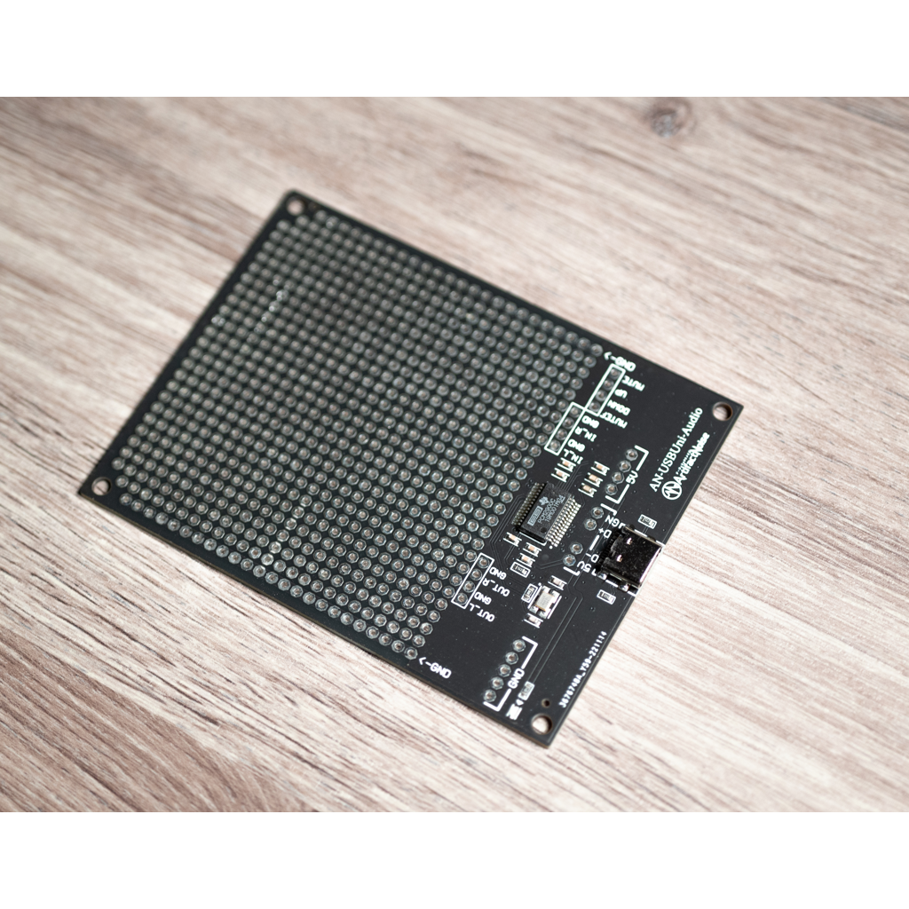

# AN-222 USB-TypeC ユニバーサルI2Cテスト基板・緑 

# 商品説明

USB-TypeCのコネクタを持ったAudioボードです。

WindowsPC、LinuxPC、MacPC、Androidに対応しております。

ドライバー不要で接続でき、オーディオインターフェースとして認識します。

ステレオ出力に加え、ライン入力も有ります。

PCM2900Cの端子をそのまま出していますので、イヤフォンやスピーカーに接続する際は、アンプ回路を実装してください。

# 仕様

- 基板サイズ
- パッド：両面スルーホール（1mm穴 2mmパッド）
- 基板厚：1.6mm
- ねじ穴:3.2mm　x4
- 追加機能：
   - 変換IC:PCM2900C
      - DAC:16-Bit x2 48KHz
      - ADC:16-Bit x2 48KHz
   - USB-TypeC　上下対応
   - USB2.0規格対応
   - CC端子に対応

# 内容物

- 実装済み基板　１枚

# 資料

 - 回路図 & 外形寸法 & 部品表

    

